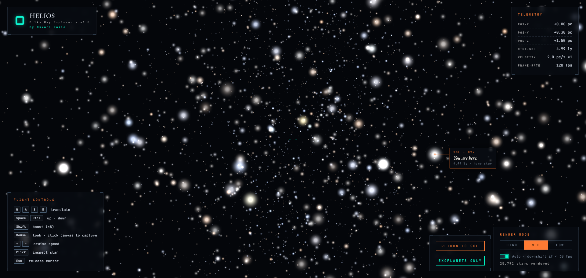

# HELIOS — Milky Way Explorer

**[Live demo →](https://oskarikaile.github.io/galaxy_simulation/)**

An interactive 3D map of the Milky Way rendered in the browser. Fly through 119,614 real stars from the HYG stellar catalog, inspect individual stars, and pull live exoplanet data straight from the NASA Exoplanet Archive.



> Built by [Oskari Kaile](https://oskarikaile.github.io/)

---

## Features

- **119,614 real stars** — positions, magnitudes, and spectral types from the HYG v4.2 database
- **First-person flight controls** — WASD + mouse look, boost, cruise speed adjustment
- **Star inspector** — click any star to see its distance, magnitude, spectral class, and constellation
- **Live exoplanet data** — queries the NASA Exoplanet Archive TAP service on demand
- **Exoplanet filter** — toggle to highlight only stars with confirmed exoplanets
- **Render modes** — High / Med / Low point-count tiers with auto-downshift below 30 fps
- **No build step** — pure ES modules via import map, runs straight from the file system

---

## Controls

| Input | Action |
|---|---|
| `W A S D` | Move forward / left / backward / right |
| `Space` / `Ctrl` | Move up / down |
| `Shift` | Speed boost ×8 |
| `+ / −` | Adjust cruise speed |
| `Mouse` | Look around (click canvas to capture) |
| `Click` star | Open inspector panel |
| `Esc` | Release cursor |

---

## Tech

- [Three.js](https://threejs.org/) r160 — WebGL rendering via ES module import map
- [HYG Database v4.2](https://github.com/astronexus/HYG-Database) — stellar catalog (astronexus)
- [NASA Exoplanet Archive TAP](https://exoplanetarchive.ipac.caltech.edu/) — live exoplanet records
- Vanilla JS, no framework, no bundler

---

## Project structure

```
├── index.html          # Shell, HUD markup, import map
├── styles.css          # All styles — observatory aesthetic
├── src/
│   ├── main.js         # Entry point, boot sequence
│   ├── starData.js     # CSV parser, HYG catalog loader
│   ├── galaxy.js       # Three.js scene, star geometry, render tiers
│   ├── controls.js     # First-person flight controls
│   ├── ui.js           # HUD updates, inspector panel, sol label
│   ├── exoplanetAPI.js # NASA TAP queries
│   └── performance.js  # FPS monitor, auto-downshift logic
└── data/
    └── hyg_v42.csv     # HYG stellar catalog
```

---

## Data sources

| Dataset | Source | License |
|---|---|---|
| HYG v4.2 stellar catalog | [astronexus/HYG-Database](https://github.com/astronexus/HYG-Database) | CC BY-SA 2.5 |
| Exoplanet records | [NASA Exoplanet Archive](https://exoplanetarchive.ipac.caltech.edu/) | Public domain |

---

## Running locally

No install needed — just serve the directory over HTTP (required for ES modules and the CSV fetch):

```bash
npx serve .
# or
python -m http.server 8000
```

Then open `http://localhost:8000`.

---

## License

MIT — see [LICENSE](LICENSE) for details.
