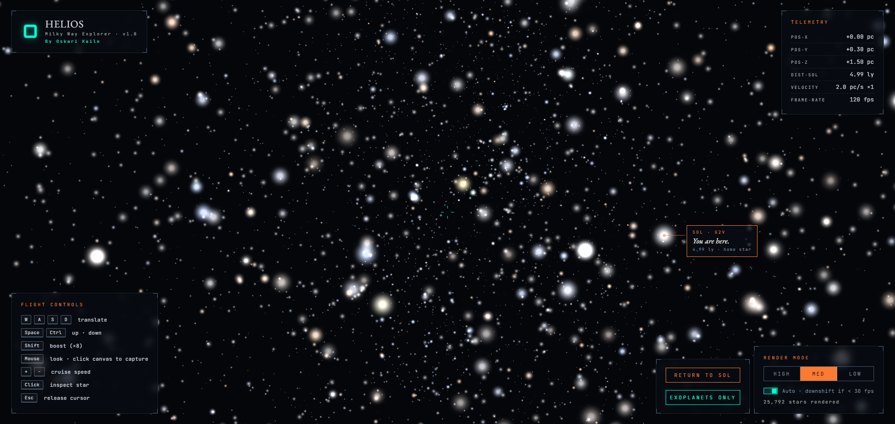

# HELIOS — Milky Way Explorer

**[Live demo →](https://oskarikaile.github.io/Galaxy_Simulation/)**

An interactive 3D map of the Milky Way rendered in the browser. Fly through 119,614 real stars from the HYG stellar catalog, inspect individual stars, and browse confirmed exoplanets from the NASA Exoplanet Archive.



> Built by [Oskari Kaile](https://oskarikaile.github.io/)

---

## Features

- **119,614 real stars** — positions, magnitudes, and spectral types from the HYG v4.2 database
- **First-person flight controls** — WASD + mouse look, boost, cruise speed adjustment
- **Star inspector** — click any star to see its distance, magnitude, spectral class, and constellation
- **Exoplanet data** — 6,000+ confirmed planets from the NASA Exoplanet Archive, bundled as a snapshot
- **Exoplanet filter** — toggle to highlight only stars with confirmed exoplanets
- **Render modes** — High / Med / Low point-count tiers with auto-downshift below 30 fps
- **No build step** — pure ES modules via import map, runs straight from the file system

---

## Controls

| Input | Action |
|---|---|
| `W A S D` | Move forward / left / backward / right |
| `Space` / `Ctrl` | Move up / down |
| `Shift` | Speed boost ×8 |
| `+ / −` | Adjust cruise speed |
| `Mouse` | Look around (click canvas to capture) |
| `Click` star | Open inspector panel |
| `Esc` | Release cursor |

---

## Tech

- [Three.js](https://threejs.org/) r160 — WebGL rendering via ES module import map
- [HYG Database v4.2](https://github.com/astronexus/HYG-Database) — stellar catalog (astronexus)
- [NASA Exoplanet Archive TAP](https://exoplanetarchive.ipac.caltech.edu/) — exoplanet records (snapshot in `data/exoplanets.json`)
- Vanilla JS, no framework, no bundler

---

## Project structure

```
├── index.html          # Shell, HUD markup, import map
├── styles.css          # All styles — observatory aesthetic
├── src/
│   ├── main.js         # Entry point, boot sequence
│   ├── starData.js     # CSV parser, HYG catalog loader
│   ├── galaxy.js       # Three.js scene, star geometry, render tiers
│   ├── controls.js     # First-person flight controls
│   ├── ui.js           # HUD updates, inspector panel, sol label
│   ├── exoplanetAPI.js # Exoplanet lookups from the bundled snapshot
│   └── performance.js  # FPS monitor, auto-downshift logic
├── scripts/
│   └── update-exoplanets.mjs # Refreshes data/exoplanets.json from NASA
├── data/
│   ├── hyg_v42.csv     # HYG stellar catalog
│   └── exoplanets.json # NASA Exoplanet Archive snapshot
└── assets/
    └── O-logo.png      # Logo
    └── O.png           # Mini Logo
    └── screenshot.png  # screenshot of the project
```

---

## Data sources

| Dataset | Source | License |
|---|---|---|
| HYG v4.2 stellar catalog | [astronexus/HYG-Database](https://github.com/astronexus/HYG-Database) | CC BY-SA 2.5 |
| Exoplanet records | [NASA Exoplanet Archive](https://exoplanetarchive.ipac.caltech.edu/) | Public domain |

---

## Running locally

No install needed — just serve the directory over HTTP (required for ES modules and the CSV fetch):

```bash
npx serve .
# or
python -m http.server 8000
```

Then open `http://localhost:8000`.

---

## Updating exoplanet data

The NASA Exoplanet Archive doesn't send CORS headers, so browsers can't query it directly from GitHub Pages. Instead, the planet list is stored in `data/exoplanets.json`. To pick up newly confirmed planets, run (Node 18+):

```bash
node scripts/update-exoplanets.mjs
```

Then commit the updated `data/exoplanets.json`.

---

## License

MIT — see [LICENSE](LICENSE) for details.
